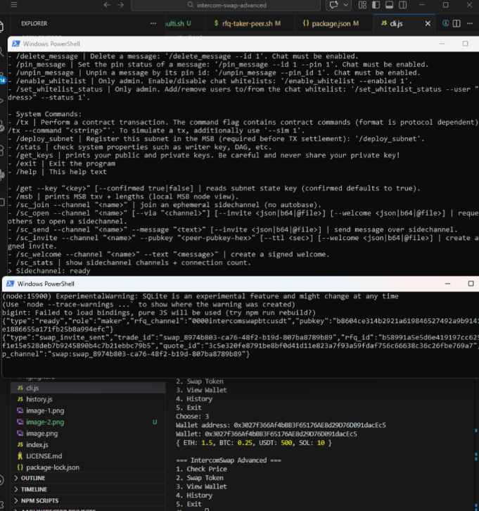

IntercomSwap Advanced Fork (Upgraded)

This repository is an advanced fork of IntercomSwap with full P2P atomic swap infrastructure, including RFQ bots, Lightning settlement, Solana escrow, SC-Bridge control, and agent-compatible automation.

This upgrade transforms the project from a swap simulator into a real IntercomSwap execution stack capable of negotiating and settling swaps across decentralized networks.

Core Features (Upgraded)
P2P Swap Infrastructure

Fully peer-to-peer swap coordination using Intercom sidechannels

Maker and taker peer architecture

Invite-only swap channels per trade

RFQ (Request-For-Quote) negotiation system

Autonomous RFQ maker and taker bots

Atomic Swap Settlement

Supports atomic swaps between:

Bitcoin over Lightning Network

USDT on Solana

Using:

Lightning invoices

Solana escrow program

Preimage-based claim mechanism

Refund safety mechanism

SC-Bridge Control Layer

WebSocket control interface for peer interaction

Secure token-based access

Message signing support

Sidechannel management tools

Service announcement support

Agent-Compatible Automation

Supports full automation by agents including:

RFQ negotiation

Quote creation and acceptance

Swap execution

Recovery operations

Wallet management

Compatible with:

Autonomous agents

CLI operators

Backend automation

LLM-controlled workflows

Additional Features
CLI Interface

Supports:

Price lookup

Swap simulation

Wallet inspection

Swap history tracking

Run:

node cli.js
Web Interface

Supports:

Swap simulation UI

Price calculation

User interaction interface

Run:

node server.js

Open browser:

http://localhost:3000
RFQ Bot System (New)
Maker Bot

Provides quotes and executes swaps.

Run:

Windows:

.\scripts\rfq-maker-peer.ps1 maker1 7001

Linux/macOS:

scripts/rfq-maker-peer.sh maker1 7001
Taker Bot

Requests quotes and accepts swaps.

Windows:

$env:SWAP_INVITER_KEYS="maker_pubkey_here"
.\scripts\rfq-taker-peer.ps1 taker1 7002

Linux/macOS:

SWAP_INVITER_KEYS="maker_pubkey_here" scripts/rfq-taker-peer.sh taker1 7002
Peer Runtime System
Start Maker Peer

Windows:

.\scripts\run-swap-maker.ps1 maker1 7001 0000intercomswapbtcusdt
Start Taker Peer

Windows:

$env:SWAP_INVITER_KEYS="maker_pubkey"
.\scripts\run-swap-taker.ps1 taker1 7002 0000intercomswapbtcusdt
Peer Manager (Background Peers)

Manage peers without keeping terminal open.

Start peer:

.\scripts\peermgr.ps1 start --name maker1 --store maker1 --sc-port 7001 --sidechannels 0000intercomswapbtcusdt

Check status:

.\scripts\peermgr.ps1 status

Stop peer:

.\scripts\peermgr.ps1 stop --name maker1
Recovery System

Supports recovery of interrupted swaps.

Commands:

.\scripts\swaprecover.ps1 list
.\scripts\swaprecover.ps1 show --trade-id <trade_id>
.\scripts\swaprecover.ps1 claim
.\scripts\swaprecover.ps1 refund
Solana Wallet Tools

Supports:

Keypair generation

Balance checking

Token transfers

Mint creation

Inventory inspection

Example:

.\scripts\solctl.ps1 balance --keypair wallet.json
Lightning Network Tools

Supports:

Create invoice

Pay invoice

Check balance

Open channels

Inspect node

Example:

.\scripts\lnctl.ps1 info
Installation

Clone repository:

git clone https://github.com/JeremyFocy/intercom-swap-advanced.git
cd intercom-swap-advanced

Install dependencies:

npm install

Install Pear runtime (required):

scripts/bootstrap.sh
File Structure (Updated)
intercom-swap-advanced/

core runtime
├ scripts/
├ stores/
├ onchain/
├ dev/

swap bots
├ rfq-maker.mjs
├ rfq-taker.mjs

bridge control
├ swapctl.mjs

wallet tools
├ solctl.mjs
├ lnctl.mjs

recovery tools
├ swaprecover.mjs

web interface
├ web/
│   ├ index.html
│   └ app.js

cli interface
├ cli.js

swap simulation
├ swap.js
├ price.js
├ wallet.js
├ history.js

documentation
├ README.md
├ SKILL.md
Swap Architecture Overview
Maker Peer
    |
    | RFQ negotiation
    |
Taker Peer
    |
    | invite-only swap channel
    |
Lightning Network  <---->  Solana Escrow Program
Swap Flow

Maker announces service

Taker sends RFQ

Maker sends quote

Taker accepts quote

Maker creates Lightning invoice

Maker locks USDT in Solana escrow

Taker pays Lightning invoice

Taker claims escrow using preimage

Atomic safety guaranteed.

Agent Integration

Supports full agent automation including:

Autonomous swap negotiation

Autonomous settlement

Autonomous recovery

Autonomous wallet management

Compatible with AI agent systems.

Proof of Functionality

Screenshots located in:

proof/

Includes:

CLI working

Web UI working

RFQ bot running

Peer runtime running

Swap negotiation logs

My Address reward : trac1nd9qztuw29kltza7usvfl5y08nacz0hr0msvyvkhgn7vg4legsysrva45v

Upstream Reference

Based on:

Trac Systems Intercom stack

Original repository:

https://github.com/Trac-Systems/intercom

Summary

This upgraded fork now provides:

Full P2P swap infrastructure

Atomic swap execution

Lightning + Solana settlement

RFQ bot automation

Peer lifecycle management

Recovery tooling

CLI + Web UI

Agent-compatible execution layer